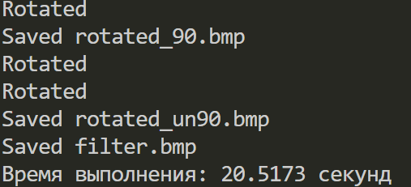
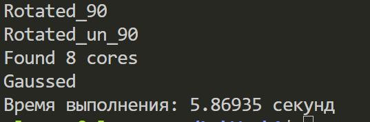
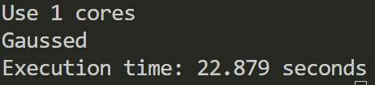
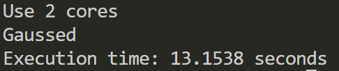
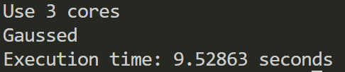
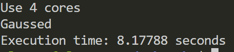
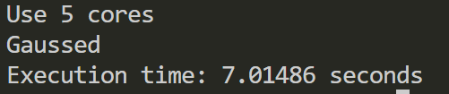
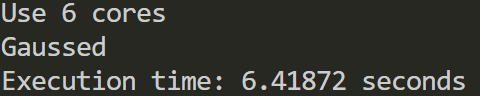
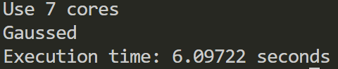
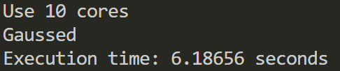

## Comparative report: Gaussian filter - single-flow vs multiflow

## Author
#### Lazarev Maksim st128707

---

## Objective

To compare performance of applying Gaussian filter on BMP-image in two implementations:
- Serial (single-threaded)
- Parallel (multithreaded, using `std::thread`)

---

## Parameters of the test image

- weight = 1792 pixels
- height = 1024 pixels
- color depth = 24
- name = ima.bmp
- location = test_images/ima.bmp

## Test Machine Specifications

- **Processor**: Intel® Core™ i5-9300H @ 2.40GHz
- **Architecture**: x86_64
- **Cores / Threads**: 4 physical cores, 8 logical threads (hyperthreading enabled)
- **Cache**:
  - L1: 128 KiB (instruction) + 128 KiB (data) × 4
  - L2: 1 MiB total
  - L3: 8 MiB shared
- **Supported Instruction Sets**: SSE, SSE2, SSE4.1/4.2, AVX, AVX2, FMA, AES-NI
- **Virtualization**: VT-x (enabled)
- **Operating System**: WSL2 (Hypervisor: Microsoft)
- **NUMA Nodes**: 1 (CPUs 0–7)

Performance was measured under a virtualized Linux environment using WSL2, which may slightly affect CPU scheduling and cache behavior.

## Brief description of the implementation

### Serial implementation

```cpp
void BmpImage::gaussFilter(int radius, double sigma)
{
    std::vector<std::vector<double>> kernel = createGaussianKernel(radius, sigma);

    for (int y = 0; y < height; ++y)
    {
        for (int x = 0; x < width; ++x)
        {
            double sumR = 0.0, sumG = 0.0, sumB = 0.0;
            for (int ky = -radius; ky <= radius; ++ky)
            {
                for (int kx = -radius; kx <= radius; ++kx)
                {
                    int ny = y + ky;
                    int nx = x + kx;
                    if (ny >= 0 && ny < height && nx >= 0 && nx < width)
                    {
                        sumR += data[ny][nx].red * kernel[ky + radius][kx + radius];
                        sumG += data[ny][nx].green * kernel[ky + radius][kx + radius];
                        sumB += data[ny][nx].blue * kernel[ky + radius][kx + radius];
                    }
                }
            }
            data[y][x].red = static_cast<uint8_t>(std::min(255.0, std::max(0.0, sumR)));
            data[y][x].green = static_cast<uint8_t>(std::min(255.0, std::max(0.0, sumG)));
            data[y][x].blue = static_cast<uint8_t>(std::min(255.0, std::max(0.0, sumB)));
        }
    }
}


int main()
{
    auto start = std::chrono::high_resolution_clock::now();
    BmpImage image;
    image.load("ima.bmp");
    image.rotate90Clockwise();
    std::cout << "Rotated" << '\n';
    image.save("rotated_90.bmp");
    std::cout << "Saved rotated_90.bmp" << '\n';
    image.rotate90CounterClockwise();
    std::cout << "Rotated" << '\n';
    image.rotate90CounterClockwise();
    std::cout << "Rotated" << '\n';
    image.save("rotated_un90.bmp");
    std::cout << "Saved rotated_un90.bmp" << '\n';
    image.gaussFilter(10, 5);
    image.save("filter.bmp");
    std::cout << "Saved filter.bmp" << '\n';
    

    auto end = std::chrono::high_resolution_clock::now();
   std::chrono::duration<double> duration = end - start;

   std::cout << "Время выполнения: " << duration.count() << " секунд\n";
    return 0;
}
```




### Parallel implementation

I have noticed that the program runtime is significantly reduced if the Gaussian filter is paralleled. Therefore, I will tell you only about it.

```cpp
void BmpImage::gaussFilter(int radius, double sigma)
{
    // Generate the Gaussian kernel once
    std::vector<std::vector<double>> kernel = createGaussianKernel(radius, sigma);

    // Get the number of available hardware threads
    int num_threads = std::thread::hardware_concurrency();

    std::cout << "Found " << num_threads << " cores" << '\n';

    if (num_threads == 0)
    {
        std::cout << "Didn't find a core, 4 cores will be used\n";
        num_threads = 4;
    }

    std::vector<std::thread> threads;

    /**
     * @brief Lambda function to process a vertical slice of rows.
     * 
     * @param start_y Starting row index (inclusive).
     * @param end_y   Ending row index (exclusive).
     */
    auto worker = [this, &radius, &kernel](int start_y, int end_y)
    {
        for (int y = start_y; y < end_y; ++y)
        {
            for (int x = 0; x < width; ++x)
            {
                double sumR = 0.0, sumG = 0.0, sumB = 0.0;

                // Apply convolution using the kernel
                for (int ky = -radius; ky <= radius; ++ky)
                {
                    for (int kx = -radius; kx <= radius; ++kx)
                    {
                        int ny = y + ky;
                        int nx = x + kx;

                        // Only include pixels within image bounds
                        if (ny >= 0 && ny < height && nx >= 0 && nx < width)
                        {
                            sumR += data[ny][nx].red   * kernel[ky + radius][kx + radius];
                            sumG += data[ny][nx].green * kernel[ky + radius][kx + radius];
                            sumB += data[ny][nx].blue  * kernel[ky + radius][kx + radius];
                        }
                    }
                }

                // Clamp results to [0, 255] and write back to the image
                data[y][x].red   = static_cast<uint8_t>(std::min(255.0, std::max(0.0, sumR)));
                data[y][x].green = static_cast<uint8_t>(std::min(255.0, std::max(0.0, sumG)));
                data[y][x].blue  = static_cast<uint8_t>(std::min(255.0, std::max(0.0, sumB)));
            }
        }
    };

    // Compute the number of rows each thread should process
    int block = height / num_threads;

    // Launch threads with different row ranges
    for (int i = 0; i < num_threads; ++i)
    {
        int start = i * block;
        int end;

        // Let the last thread handle any remaining rows
        if (i == num_threads - 1)
        {
            end = height;
        }
        else
        {
            end = (i + 1) * block;
        }

        threads.push_back(std::thread(worker, start, end));
    }

    // Wait for all threads to complete
    for (auto& t : threads)
    {
        t.join();
    }
}
```

#### In brief, I just paralleled the for loop. The height of the matrix is divided by the number of threads that were created. Then each thread is given its own piece of the matrix, which it counts. For this purpose, a lambda function was created to easily pass parameters.



### The time is greatly reduced

## Tests for different number of cores


















#### Initially, the program's execution time dropped significantly as the number of threads increased. However, as the thread count approached 8, the performance gains began to diminish. Beyond 8 threads, execution time actually started to increase, indicating overhead from excessive parallelism.

## Conclusion:

The Gaussian filter demonstrates strong performance scaling up to a certain number of threads (around 8 in our case), after which parallel overhead outweighs the benefits of additional threads. This suggests that the optimal thread count is closely tied to the number of physical CPU cores. Over-threading can lead to contention, context switching, and cache inefficiencies, ultimately reducing performance.